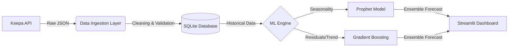

# 🚀 PredictPC: Intelligent Hardware Price Forecasting

<!-- Badges Area -->


**PredictPC** is an end-to-end machine learning solution designed to solve the problem of price volatility in the PC component market. It ingests real-time data, processes historical trends, and deploys advanced forecasting models to recommend the optimal buying window for GPUs and CPUs.

---

## 🧐 The Challenge
Building a PC is an investment. Prices for components like the **RTX 4060** or **Ryzen 7** can fluctuate wildly due to supply chain issues, crypto-mining demand, or seasonal sales. Enthusiasts often overpay by buying at the local peak.

**The Solution?** An intelligent agent that monitors the market 24/7 and answers the question: *"Should I buy now or wait?"*

## 🏗️ Technical Architecture

The system is built on a modular ETL and inference pipeline:



### Key Components
1.  **Data Ingestion (`src/data`)**:
    *   Connects to the **Keepa API** to retrieve high-resolution price history (Amazon).
    *   Handles rate limiting and data normalization (filling gaps, adjusting for used/new pricing).
    *   Persists data in a local **SQLAlchemy** (SQLite) database to minimize API costs and latency.

2.  **Machine Learning Core (`src/models`)**:
    *   **Facebook Prophet**: Used as the baseline model to capture daily/weekly seasonality and overall market trend.
    *   **Gradient Boosting (GBM)**: Implemented (LightGBM/XGBoost) to capture non-linear patterns and short-term volatility that regression models miss.
    *   **Forecast Horizon**: Optimized for a 7-day lookahead, balancing accuracy with utility.

3.  **Visualization Layer (`src/dashboard`)**:
    *   A reactive **Streamlit** application.
    *   Uses **Plotly** for interactive, zoomable time-series charts.
    *   Dynamic filtering by component category (GPU/CPU).

## 📂 Project Structure

```text
predictpc/
├── data/                  # Local database and raw storage
├── src/
│   ├── analysis/          # EDA notebooks and feature engineering
│   ├── dashboard/         # Streamlit UI entry point
│   ├── data/              # Keepa client & database models
│   ├── models/            # Prophet & GBM model wrappers
│   └── config.py          # Central configuration (products, API keys)
├── .env                   # Environment secrets (GitIgnored)
└── requirements.txt       # Python dependencies
```

## 📦 Features
*   **Real-time Intelligence**: Updates prices on-demand.
*   **Dual-Model Forecasting**: Combines statistical and ML approaches for robust predictions.
*   **Smart Catalog**: Pre-configured tracking for top-tier hardware (RTX 30/40 series, Ryzen 5/7/9, Intel Core i5/i7).
*   **Privacy First**: Local data storage with zero external tracking.

## 🛠️ Installation & Setup

1.  **Clone the repository**
    ```bash
    git clone https://github.com/mikelballay/PredictPC-Price-Intelligence.git
    cd PredictPC-Price-Intelligence
    ```

2.  **Environment Setup**
    ```bash
    python -m venv .venv
    # Windows
    .\.venv\Scripts\Activate.ps1
    # Linux/Mac
    source .venv/bin/activate
    pip install -r requirements.txt
    ```

3.  **Configuration**
    Create a `.env` file in the root directory:
    ```env
    KEEPA_API_KEY=your_keepa_api_key_here
    ```

4.  **Launch**
    ```bash
    streamlit run src/dashboard/app.py
    ```

## 🚀 Roadmap / Future Improvements
- [ ] **Sentiment Analysis**: Scrape Reddit/Twitter to gauge demand sentiment affecting prices.
- [ ] **Multi-Retailer Support**: Expand beyond Amazon (Newegg, PCComponentes).
- [ ] **Alert System**: Email/Discord notifications when price drops below predicted threshold.
- [ ] **Dockerization**: Containerize the app for easier deployment.

---
*Created by [Mikel Ballay] - Machine Learning Engineer*
*Connect with me on [LinkedIn](#) | check out my [Portfolio](#)*
